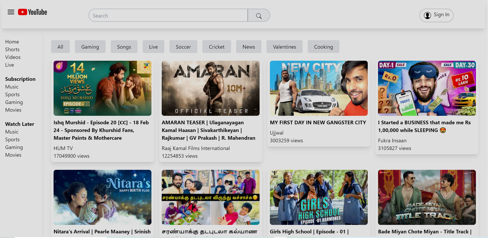
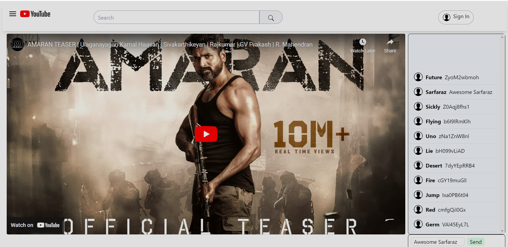
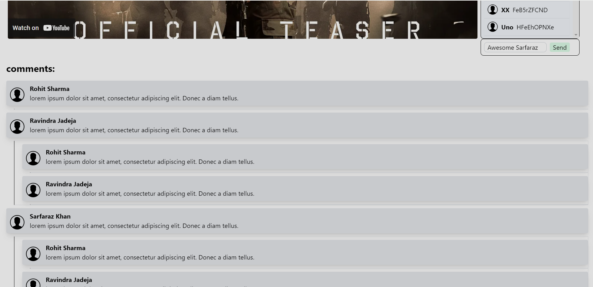
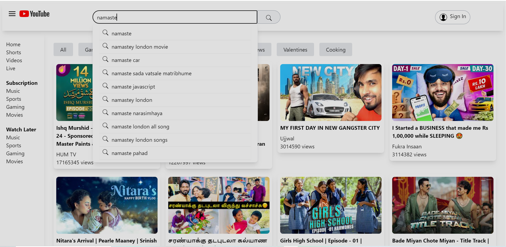

### Notes

- Create-react-app is the package that we will be executing using npx to setup react application
- Tailwind css installation steps:
  - npm i - D Tailwind css
  - npx Tailwind css init : for initialization of Tailwind css configuration
  - content: ["./src/**/*.js"], : configure in tailwind.config.js
  - npm i @reduxjs/toolkit
  - npm i react-redux

#### What will be creating

- Head
- Body
  - Sidebar
    - MenuItems
  - MainContainer
    - ButtonsList
    - VideoContainer
    - VideoCard

Steps to develop the application fast
create a folder component --> create a file Head.js --. use 'rafce' shortcut to create a component

create utils folder --> create a store.js
create appSlice which contain app level data
configure reduce on store --> wrap the provider in app.js

Go to the youtube video api --> copy http url --> go to auth youtube --> create credentials
https://console.cloud.google.com/projectselector2/apis/credentials?pli=1&supportedpurview=project

create the project --> create the API key

#### Installation npm for routing

npm i react-router-dom

Searchparam reference: https://reactrouter.com/en/main/hooks/use-search-params

sir code reference: https://bitbucket.org/namastedev/my-youtube/src/master/

Incase, if you feel issue with CORS, kindly check with Chrome CORS plugin, enable it and test in chrome browser.

